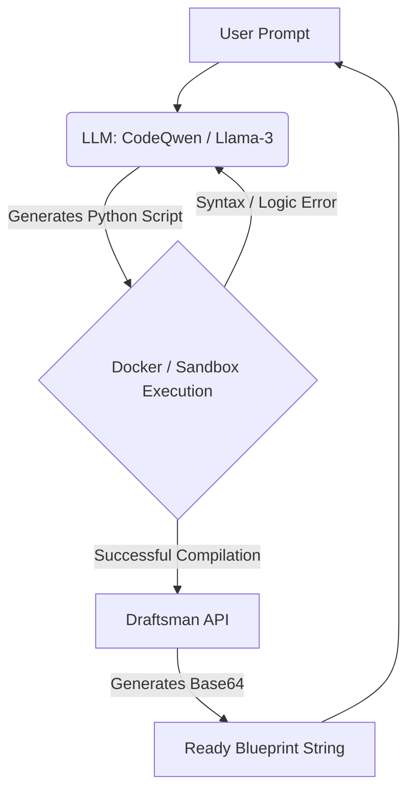

# FactorioLLM: Text-to-Blueprint Generator


**FactorioLLM** is an AI-powered tool that generates functional, ready-to-use blueprints for the game Factorio based on natural language prompts. 

Instead of manually placing entities or searching the web for specific layouts, you can just type: 
> *"Create an expandable copper smelting line for 24 furnaces using red belts,"* 

...and receive a working blueprint string instantly.

---

## How It Works (The Core Concept)

Factorio blueprints are essentially JSON objects containing raw coordinates, compressed via `zlib` and encoded in `base64`. 

**The Challenge:** Large Language Models (LLMs) lack spatial reasoning. Asking an LLM to output a raw JSON blueprint with exact x/y coordinates for hundreds of entities results in broken, non-functional layouts. Models do not inherently understand "tileability" or belt alignment.

**The Solution:** FactorioLLM uses a **Text-to-Code** approach. 
Instead of predicting JSON coordinates, the LLM generates a **Python script** utilizing the [factorio-draftsman](https://github.com/redruin1/factorio-draftsman) library. Concepts like spacing, alignment, and ratios are naturally handled through Python `for` loops, variables, and math. The backend then safely executes this script to compile a flawless blueprint string.

### The Agentic Loop Pipeline

The project features an automatic self-healing loop:



---

## Tech Stack

* **AI Models:** Fine-tuned Code-specific LLMs (Llama-3-8B-Instruct, CodeQwen).
* **Training:** `Unsloth`, Hugging Face `transformers`, `PEFT` (LoRA).
* **Factorio API:** `factorio-draftsman` for programmable blueprint compilation.
* **Backend:** `FastAPI` (serving) & isolated `Docker` environments (safe code execution).

---

## Getting Started

*(Note: The project is currently in active development. These instructions represent the local testing setup).*

### Prerequisites
* Python 3.10+
* Factorio (for testing the generated blueprints)

### Installation

1. Clone the repository:
   ```bash
   git clone https://github.com/yourusername/FactorioLLM.git
   cd FactorioLLM
   ```

2. Create a virtual environment and activate it:
   ```bash
   python -m venv venv
   source venv/bin/activate  # On Windows: venv\Scripts\activate
   ```

3. Install dependencies:
   ```bash
   pip install -r requirements.txt
   ```
   *(Make sure `factorio-draftsman` is included in your requirements)*

### Basic Usage

To test the blueprint generation via a script:
```bash
python generate.py --prompt "Create a 4x4 belt balancer using fast transport belts"
```
The console will output the base64 string starting with `0eN...` which you can paste directly into Factorio using the **Import String** tool.

---

## Project Roadmap

- [x] **Phase 0: Proof of Concept** - Manual validation of Draftsman code generation.
- [ ] **Phase 1: Data Engineering** - Building a decompiler to convert existing JSON blueprints into Draftsman Python scripts to create a massive dataset.
- [ ] **Phase 2: Synthetic Prompts** - Using frontier models (GPT-4o/Claude) to attach diverse human prompts to the decompiled scripts.
- [ ] **Phase 3: Fine-Tuning** - Training a LoRA adapter for open-source LLMs to understand Factorio logic and Draftsman syntax.
- [ ] **Phase 4: Agentic Loop** - Implementing the self-healing sandbox execution.
- [ ] **Phase 5: User Interface** - Releasing a Web UI (Gradio) or a Telegram bot for public use.

---

## Contributing

Contributions are welcome! If you love Factorio and Machine Learning, feel free to open an issue or submit a Pull Request. We are currently looking for help with:
* Gathering and filtering high-quality blueprints for the dataset.
* Optimizing the `decompiler.py` for complex mods and circuit networks.

## License

This project is licensed under the MIT License - see the [LICENSE](LICENSE) file for details.

*Disclaimer: This project is created for educational and community purposes. "Factorio" is a registered trademark of Wube Software Ltd.*
```