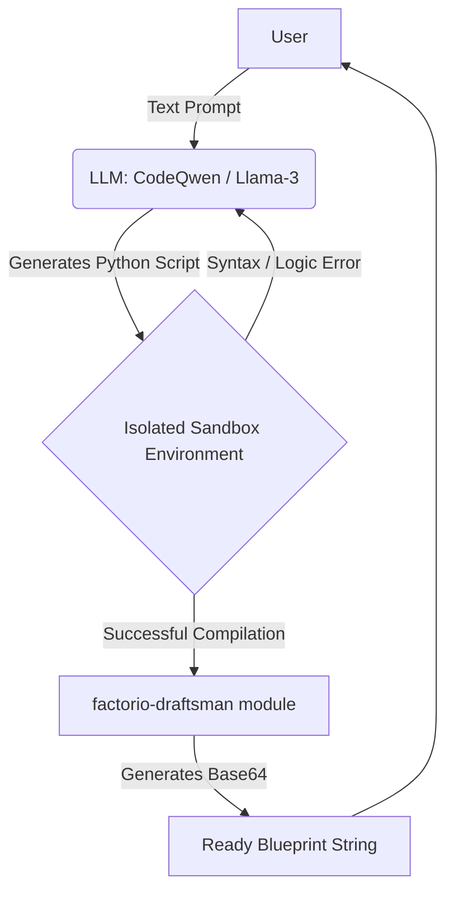

# FactoLLM: Text-to-Blueprint Generator


**FactoLLM** is a Machine Learning pet project that generates working blueprints for the game Factorio based on natural language text prompts. 

Instead of manually designing layouts, a user can simply write: *"Create an expandable copper smelting line for 24 furnaces using red belts,"* and receive a ready-to-use blueprint string to paste directly into the game.

---

## Architectural Solution (Why not raw JSON?)

Under the hood, Factorio blueprints are JSON objects containing lists of coordinates (e.g., `{"name": "inserter", "x": 12.5, "y": -4.0}`), compressed via `zlib` and encoded in `base64`. 

**The Problem:** Large Language Models (LLMs) lack spatial reasoning. Forcing an LLM to generate raw coordinates for hundreds of objects in a JSON file results in a chaotic, non-functional mess. The model cannot grasp the concepts of exact proportions or "tileability" (the ability to place blueprints seamlessly side-by-side).

**The Solution (Intermediate Code Generation):** 
FactoLLM utilizes a **Text-to-Code** approach. 
Instead of JSON, the LLM generates **Python code** using the [factorio-draftsman](https://github.com/redruin1/factorio-draftsman) library. 
Tileability, ratios, and spacing are easily expressed in code through `for` loops, mathematical variables, and logic. The backend then executes this code and compiles it into a perfect, error-free blueprint.

---

## Pipeline Architecture (Agentic Loop)

The project implements a Self-Healing execution loop.



1. **Request:** The user submits a prompt.
2. **Generation:** The LLM writes a Python script (using Draftsman syntax).
3. **Validation:** The script is executed in a secure environment (sandbox/Docker).
4. **Self-Healing:** If the `draftsman` library throws an error (e.g., pipes don't align), the error traceback is sent back to the LLM with a request to fix the code.
5. **Result:** Upon successful execution, the user receives the final blueprint string.

---

## Tech Stack

*   **Model:** Llama-3-8B-Instruct / CodeQwen-1.5-7B.
*   **Fine-tuning:** Hugging Face `transformers`, `PEFT`, `Unsloth` (for 2x faster LoRA training).
*   **Factorio API:** `factorio-draftsman` (programmable blueprint generation).
*   **Backend:** `FastAPI` (request handling) and `Docker` (for isolated code execution).
*   **Interface:** `Gradio` (Web UI) or `aiogram` (Telegram Bot).

---

## Implementation Roadmap

### Phase 1: Data Engineering & Synthetic Dataset 
Since ready-made "Text -> Draftsman Code" pairs do not exist, the dataset is built via reverse engineering:
- Write ~50-100 baseline Python scripts for typical layouts (balancers, smelting lines, malls, train stations).
- Use powerful model APIs (GPT-4o/Claude 3.5) to generate dozens of diverse user prompt variations for each script.
- Format the dataset in an `Instruct` layout (Instruction -> Context -> Response).

### Phase 2: LLM Fine-Tuning
- Quantize the chosen Open-Source model (4-bit/8-bit).
- Train a LoRA adapter using the `Unsloth` framework on the generated dataset.
- Expose the model to Factorio-specific vocabulary (*main bus*, *tileable*, *mall*, *yellow belt*, *throughput*).

### Phase 3: Infrastructure & Agentic Loop
- Set up a secure sandbox (Docker) for executing LLM-generated code.
- Implement reflection logic (re-prompting the LLM automatically when catching a `Traceback` error).

### Phase 4: User Interface
- Deploy a user-friendly UI using Gradio or Streamlit.
- Integrate a blueprint renderer to show a preview image of the layout before the user pastes it into the game.

---

## Example of Execution

**User Prompt:**
> "Write a script for an iron smelting line with 12 stone furnaces. Use yellow belts and standard inserters. Make it tileable along the X-axis."

**Generated LLM Code (Draftsman):**
```python
from draftsman.blueprintable import Blueprint
from draftsman.entity import StoneFurnace, Inserter, TransportBelt

bp = Blueprint()
bp.name = "Expandable Iron Smelting"

furnace_count = 12
for i in range(furnace_count):
    # Place furnaces
    furnace = StoneFurnace("stone-furnace", position={"x": i * 2, "y": 0})
    bp.entities.append(furnace)
    
    # Input belt for ore and coal
    belt_in = TransportBelt("transport-belt", position={"x": i * 2, "y": -2})
    bp.entities.append(belt_in)
    
    # Inserters
    ins_in = Inserter("inserter", position={"x": i * 2, "y": -1}, direction=4)
    bp.entities.append(ins_in)

# Blueprint string compilation is handled automatically by the backend
```

**Result Output:**
`0eNq1kNsKwyAMhl... [LONG BASE64 STRING] ...`

---

## Future Improvements
Planned features include:
1. Support for major overhaul mods (Space Exploration, Krastorio 2).
2. Resource cost optimization algorithms.
3. Circuit network (combinator logic) generation based on textual condition descriptions.

---
*This project is created for educational and portfolio purposes. Factorio is a trademark of Wube Software.*
```